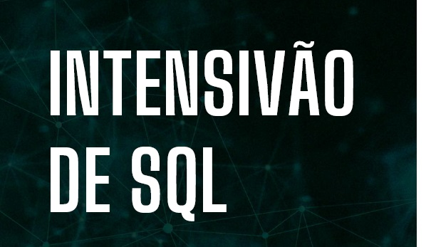

# Imersão SQL - hashtag Treinamentos

Na Imersão de SQL feita pela Hashtag Treinamentos e realizada em 2022 foram abordados conceitos básicos de criação e manipulação de bancos de dados relacionais.

Neste repositório estão disponíveis os materiais de estudos da imersão.
